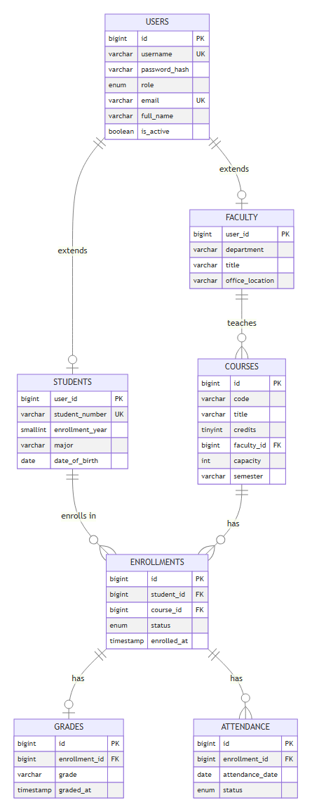
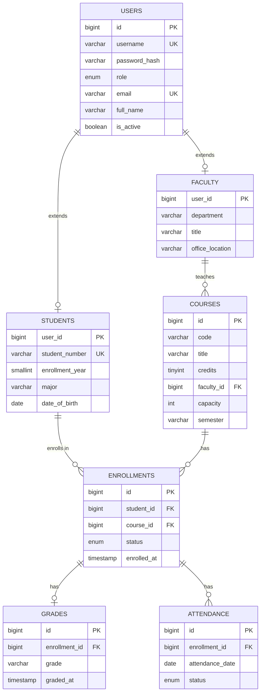
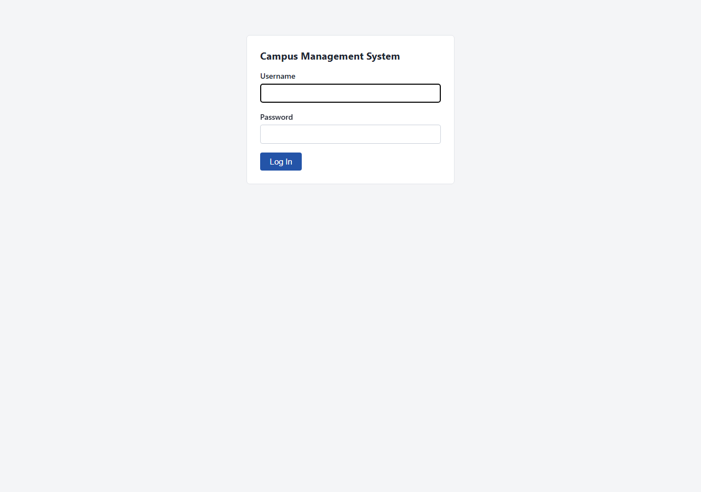
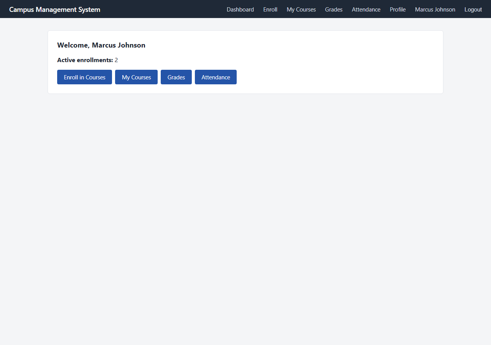
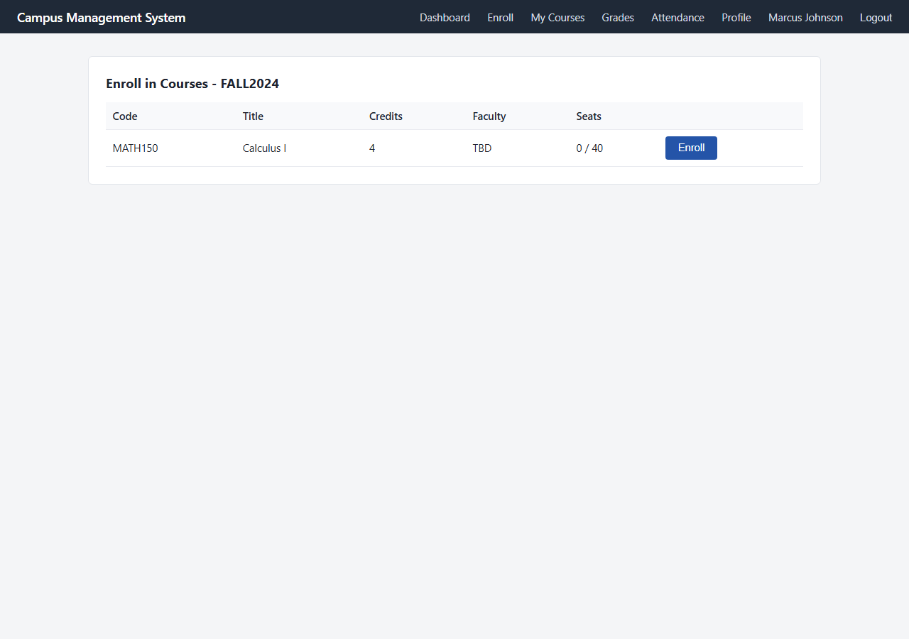
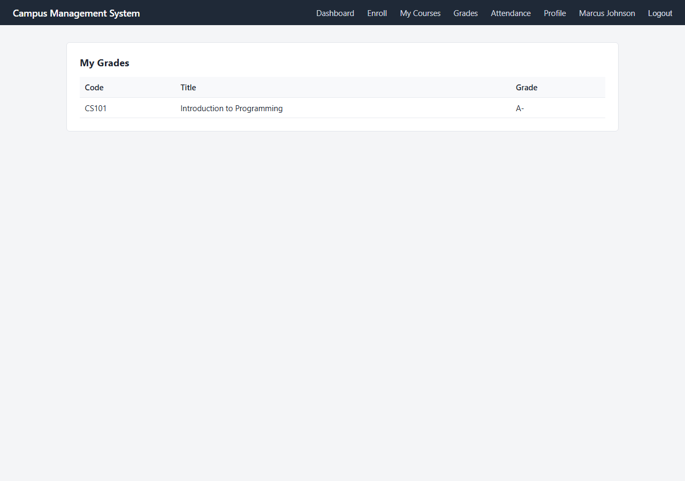
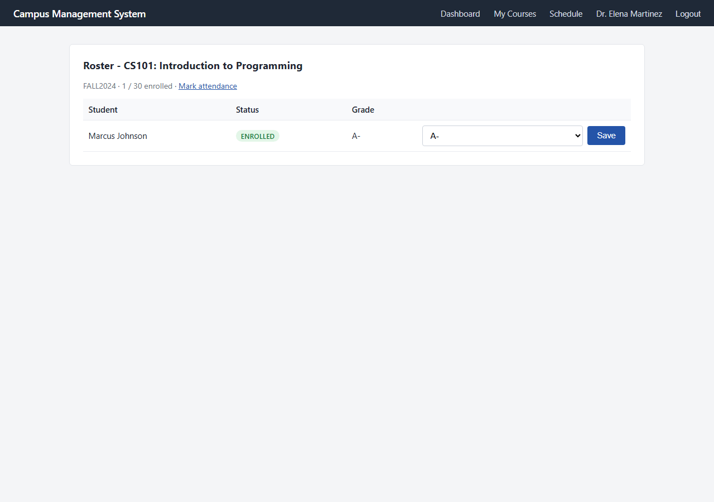
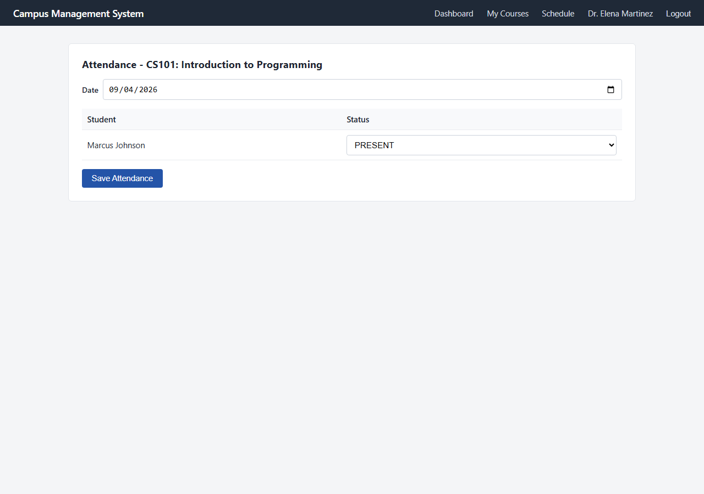
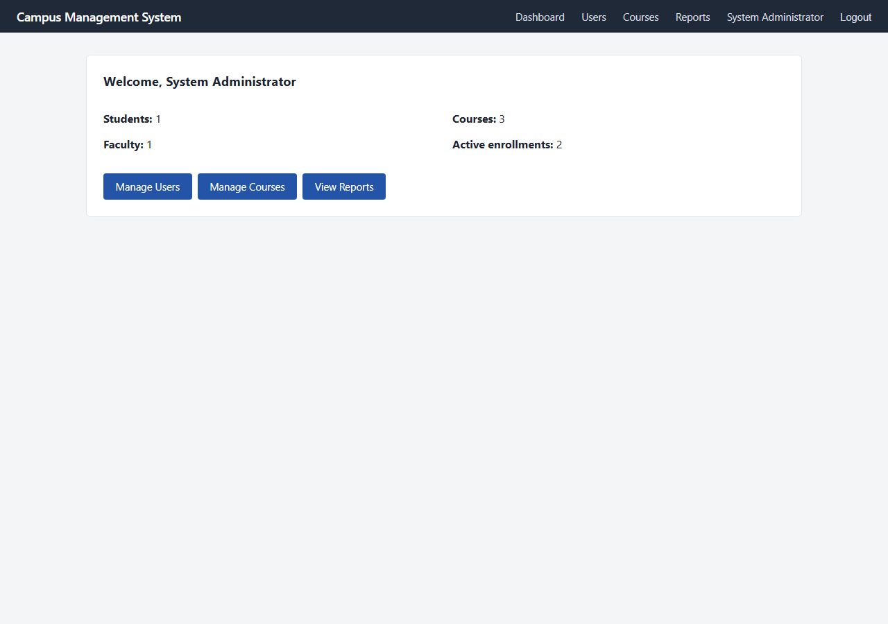
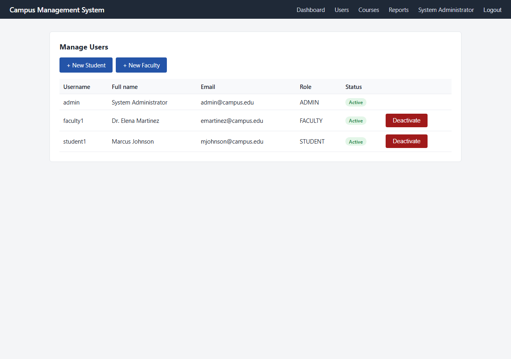

# Campus Management System

A multi-role (student / faculty / admin) campus management web application,
built as a classic Java EE stack: Servlets, JSP/JSTL, JDBC, and MySQL,
deployed on Apache Tomcat. It exists as a portfolio/learning project
demonstrating a normalized relational schema, parameterized JDBC access,
session-based authentication with CSRF protection, and a layered
Controller → Service → DAO architecture, without reaching for a framework
like Spring.

Reconstructed from the original project's requirements and design; see
"Project history" at the end of this README for how that reconstruction
was verified.

## Features

### Student

- Log in / log out
- Browse and enroll in courses open for the current semester (capacity and
  duplicate-enrollment enforced)
- View and drop current enrollments
- View grades
- View attendance
- Update profile (name, email, major, date of birth)

### Faculty

- Log in / log out
- View assigned courses and current-semester schedule
- View a course roster
- Enter and update student grades
- Mark attendance for a whole roster on a given date

### Admin

- Log in / log out
- Create student and faculty accounts
- Deactivate / reactivate accounts
- Create and edit courses; assign faculty to a course
- View system-wide reports (student/faculty/course counts, active
  enrollments, per-course enrollment)

## Architecture

```text
Browser
   |
Servlet Filter      (CsrfFilter, AuthorizationFilter)
   |
Servlet / Controller (com.campus.controller)
   |
Service              (com.campus.service)
   |
DAO                  (com.campus.dao)
   |
JDBC
   |
MySQL
```

Full write-up - layers, request lifecycle, authentication, authorization,
session management, CSRF, DAO architecture, error handling, deployment
architecture - is in [docs/architecture.md](docs/architecture.md).

### Entity-relationship diagram



<details>
<summary>Mermaid source (renders natively on GitHub)</summary>



</details>

## Tech stack

- Java 17
- Jakarta EE 10 Servlet API 6.0 / JSP / JSTL 3.0 (`jakarta.*` namespace)
- JDBC with `PreparedStatement` throughout - no ORM
- MySQL 8.0
- Apache Tomcat 10.1.x
- jBCrypt for password hashing
- Maven (build), JUnit 5 + Mockito (unit tests), H2 in MySQL-compatibility
  mode (DAO integration tests)

## Database setup

The schema lives at [db/migrations/001_schema.sql](db/migrations/001_schema.sql)
(3NF, foreign keys, `ON DELETE` behavior appropriate to each relationship,
unique/CHECK constraints, and indexes supporting the app's queries). Optional
sample data - one account per role plus a few courses, matching the demo
credentials below - is at
[db/seed/002_sample_data.sql](db/seed/002_sample_data.sql).

1. **Load the schema** (creates the `campus_management` database):

   ```bash
   mysql -u root -p < db/migrations/001_schema.sql
   ```

2. **Create a least-privilege application user** (matching the credentials
   `META-INF/context.xml` uses by default - change the password before any
   real deployment):

   ```sql
   CREATE USER 'campus_app'@'%' IDENTIFIED BY 'campus_app_password';
   GRANT SELECT, INSERT, UPDATE, DELETE ON campus_management.* TO 'campus_app'@'%';
   FLUSH PRIVILEGES;
   ```

3. **(Optional) Load sample data:**

   ```bash
   mysql -u root -p < db/seed/002_sample_data.sql
   ```

4. **Configuration required by the application:** the JDBC URL, username,
   and password are declared in
   [src/main/webapp/META-INF/context.xml](src/main/webapp/META-INF/context.xml)
   as a Tomcat-managed JNDI `Resource` named `jdbc/campusdb` (see "Tomcat
   deployment" below for how to override it without editing the WAR).

## Running locally

```bash
mvn clean test     # unit tests (mocked DAOs, no database needed)
mvn verify          # unit + DAO integration tests (H2, no MySQL needed) + packages the WAR
mvn package          # just build target/campus-management-system.war
```

`mvn verify` runs the DAO integration tests against an in-memory H2 database
in MySQL compatibility mode, loaded from the real `001_schema.sql`, so the
build doesn't require a running MySQL server to pass. Deploying the app for
actual use still requires MySQL, as described above.

## Tomcat deployment

1. Build the WAR: `mvn clean package` → `target/campus-management-system.war`.
2. Copy it into Tomcat's webapps directory:

   ```bash
   cp target/campus-management-system.war $CATALINA_HOME/webapps/
   ```

3. **DataSource/JNDI configuration:** the WAR already includes
   `META-INF/context.xml` declaring the `jdbc/campusdb` resource, so no
   further Tomcat configuration is required for a quick local run against a
   MySQL instance on `localhost:3306` with the `campus_app` user created
   above. For any real deployment, override the connection details instead
   of editing the WAR, by placing a `Context` block with your real
   credentials at `$CATALINA_BASE/conf/Catalina/localhost/campus-management-system.xml`
   - a `Resource` defined there takes precedence over the one bundled in the
     WAR.
4. **MySQL connector:** already bundled in `WEB-INF/lib` (the
   `com.mysql:mysql-connector-j` dependency is compile-scope, not
   `provided`), so nothing needs to be added to Tomcat's own `lib/`.
5. Start Tomcat: `$CATALINA_HOME/bin/startup.sh` (or `startup.bat` on
   Windows).
6. Application URL: `http://localhost:8080/campus-management-system/`

## Demo credentials

These accounts exist only if `db/seed/002_sample_data.sql` has been loaded,
and were verified against a real deployment (see "Project history" below).

| Role    | Username   | Password         |
|---------|------------|------------------|
| Admin   | `admin`    | `Admin@12345`    |
| Faculty | `faculty1` | `Faculty@12345`  |
| Student | `student1` | `Student@12345`  |

## Screenshots

Captured from the application running on Tomcat 10.1 against a MySQL 8.0
database, using the seed data and demo credentials above.

| | |
|---|---|
| **Login** |  |
| **Student dashboard** |  |
| **Course enrollment** |  |
| **Student grades** |  |
| **Faculty roster & grading** |  |
| **Faculty attendance** |  |
| **Admin dashboard** |  |
| **Admin user management** |  |

More screenshots (student's own enrollments/attendance, faculty's course
list, admin's course management and reports) are in
[docs/screenshots/](docs/screenshots/).

## Testing

```text
src/test/java/com/campus/util/PasswordUtilTest.java          - unit
src/test/java/com/campus/service/AuthServiceTest.java        - unit
src/test/java/com/campus/service/EnrollmentServiceTest.java  - unit
src/test/java/com/campus/service/GradeServiceTest.java       - unit
src/test/java/com/campus/service/AttendanceServiceTest.java  - unit
src/test/java/com/campus/dao/UserDaoIntegrationTest.java              - integration (H2)
src/test/java/com/campus/dao/EnrollmentDaoIntegrationTest.java        - integration (H2)
src/test/java/com/campus/dao/GradeAttendanceDaoIntegrationTest.java   - integration (H2)
```

Unit tests mock DAOs with Mockito and run under `mvn test` (Surefire).
Integration tests run the real `001_schema.sql` against an in-memory H2
database in MySQL-compatibility mode and run under `mvn verify` (Failsafe) -
see `pom.xml` for the include/exclude patterns that keep the two separate.

## Project history

This repository is a reconstruction of a personal project whose original
development environment was lost; it was rebuilt in a single continuous
session rather than over its original historical window (intended to be
approximately September 2024 - January 2025), so the Git history's commit
dates reflect when the reconstruction actually happened, not the original
timeline. Every commit in this history corresponds to a working, verified
increment: `mvn verify` passing, or an actual deployment to a containerized
Tomcat 10.1 + MySQL 8.0 stack exercised through real HTTP requests (login,
enrollment, grading, attendance, admin account/course management,
authorization and CSRF rejection cases) - see individual commit messages for
what was verified at each stage.
